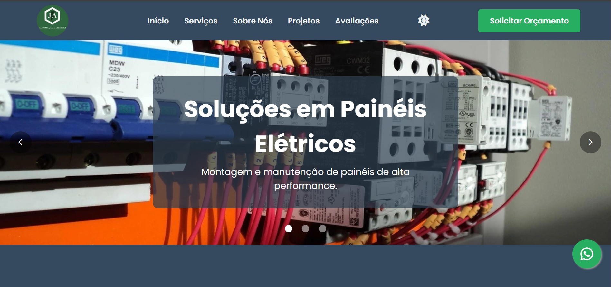

  

<h1 align="center">Olá, eu sou o Kayky Gonçalves! 👋</h1>

  Um desenvolvedor web apaixonado por transformar ideias em soluções digitais. Atualmente, estou focado em aprimorar minhas habilidades em <strong>React e Node.js</strong> para construir aplicações completas e eficientes.

- 👨‍💻 Explorando o universo do desenvolvimento Front-end.
- 🚀 Buscando minha primeira oportunidade para colocar em prática meu conhecimento e contribuir em projetos incríveis.
- 📫 Como me encontrar: [kaykyds5@hotmail.com](mailto:kaykyds5@hotmail.com)

  

  <h2>Minhas Habilidades 💻</h2>
  
  
  
  
  
  
  

  <h2>Minhas Estatísticas no GitHub 📊</h2>
  
  

  ## 🚀 Meus Principais Projetos

<table>
  <tr>
    <td width="50%">
      <h3 align="center">Porftólio Profissional</h3>
      

        
        

          
          
        

        

          Uma página de portfólio para um engenheiro eletricista com html,css e js. 
        

      

    </td>
    <td width="50%">
      <h3 align="center">Landing page IPJD</h3>
      

        
        

          
        

        

          Uma landing page criada para divulgar os trabalhos de uma igreja.
        

      

    </td>
  </tr>
</table>

  

  <h2>Onde me encontrar:</h2>
   
  
  

Obrigado pela visita! 😊
